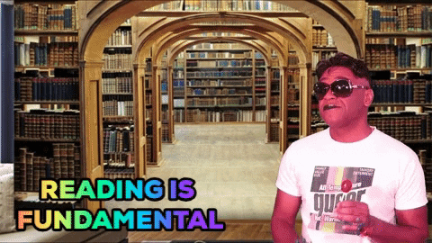

# Literature review for my Ph.D.

{:refdef: style="text-align: center;"}

{: refdef}

## ML for Retrosynthesis
### Reviews
- [Deep learning in retrosynthesis planning: datasets, models and tools](https://academic.oup.com/bib/article/23/1/bbab391/6375056)

### Seminal work
- [Planning chemical syntheses with deep neural networks and symbolic AI](https://www.nature.com/articles/nature25978)

### SOTA methods
- [Barking up the right tree: an approach to search over molecule synthesis DAGs](https://papers.nips.cc/paper/2020/hash/4cc05b35c2f937c5bd9e7d41d3686fff-Abstract.html)
- [Amortized Tree Generation for Bottom-up Synthesis Planning and Synthesizable Molecular Design](https://openreview.net/forum?id=FRxhHdnxt1)
- [Retrosynthesis Prediction with Conditional Graph Logic Network](https://papers.nips.cc/paper/2019/hash/0d2b2061826a5df3221116a5085a6052-Abstract.html)

## Graph NDE
- [GRAND: Graph Neural Diffusion](https://openreview.net/pdf?id=_1fu_cjsaRE)

## Retrosynthesis (chemistry)
- [Is organic chemistry really growing exponentially?](https://onlinelibrary.wiley.com/doi/epdf/10.1002/ange.202111540)
- Book: [The logic of chemical synthesis](https://ia800205.us.archive.org/30/items/Logic_of_Chemical_Synthesis_Corey_1989/Logic_of_Chemical_Synthesis_Corey_1989_text.pdf)
- [The Logic of Chemical Synthesis: Multistep Synthesis of Complex Carbogenic Molecules (Nobel Lecture)](https://onlinelibrary.wiley.com/doi/10.1002/anie.199104553)